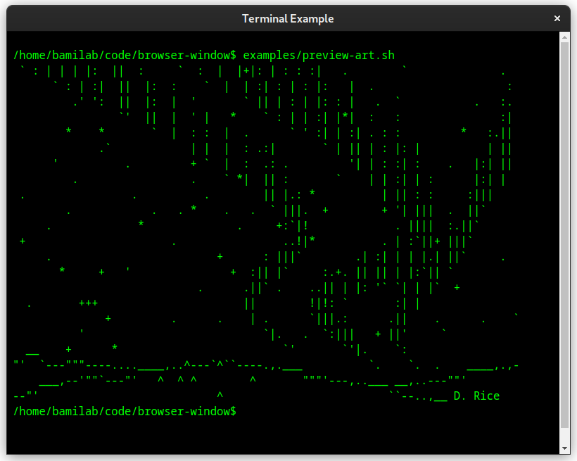

# BrowserWindow

_BrowserWindow_ is a simple Rust crate for utilizing a browser engine to create a graphical user interface.
Just like [Electron.js](https://www.electronjs.org/), you can use it to build a GUI with HTML, CSS & JS, or just to have some basic browser functionality at your disposal.

## Introduction

_BrowserWindow_ is designed to be easy to use, and work cross-platform. It utilizes the async/await
syntax & it even has optional thread-safe handles. There are currently two different underlying
browser frameworks that can be selected: WebkitGTK or CEF.
These particular frameworks have cross-platform support.

You can look at some [examples](https://github.com/bamilab/browser-window/tree/master/examples) to
get an idea how you can use the api.

## Getting Started

The underlying framework, be it CEF or WebkitGTK, needs to be installed on your system. There is a
[guide](./docs/GETTING-STARTED.md) to get you started with using _BrowserWindow_ on your own system.

## License

This software is available as open source software under a MIT license, for maximum freedom and
minimum restrictions.

## Future Plans

At the moment, there is a decent set of functionality available, but if something is lacking, please [submit an issue](https://github.com/bamilab/browser-window/issues), and I might implement it if it the functionality is common enough.

Otherwise, here are some things that are yet to come:

* Support for the Edge WebView2 framework on Windows.
* Events
* Support for Webkit + Cocoa on MacOS.
